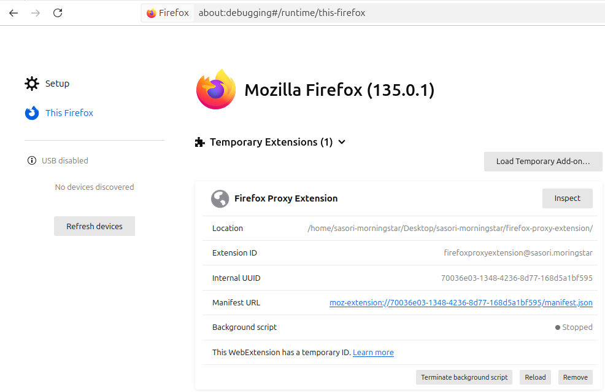
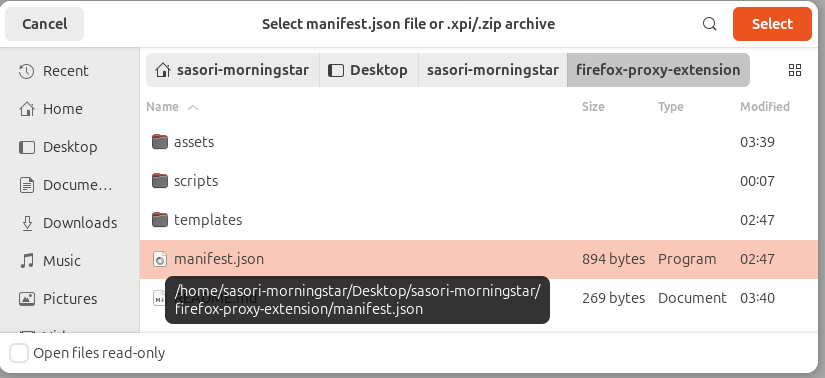
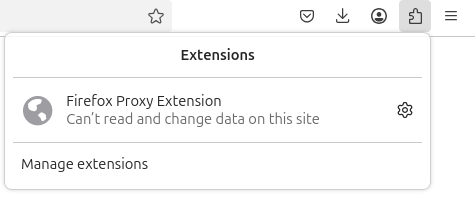
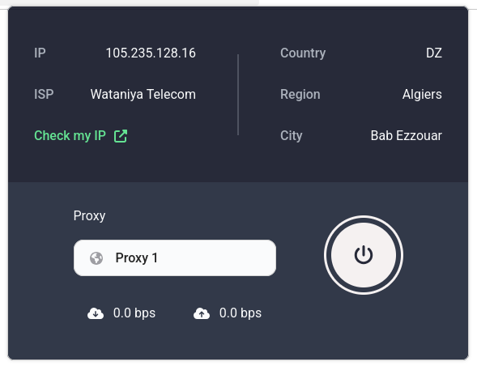
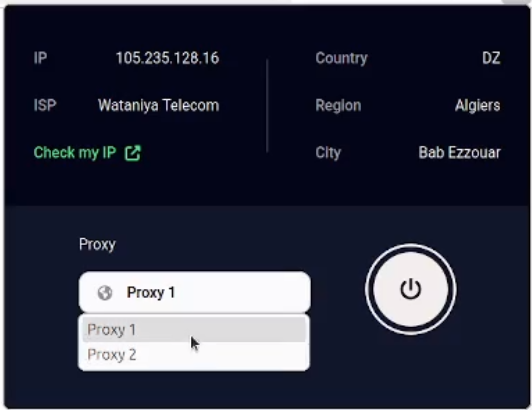
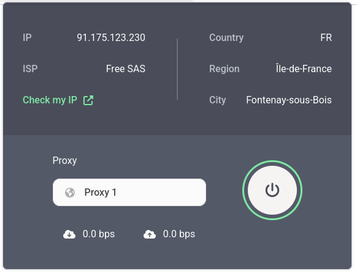
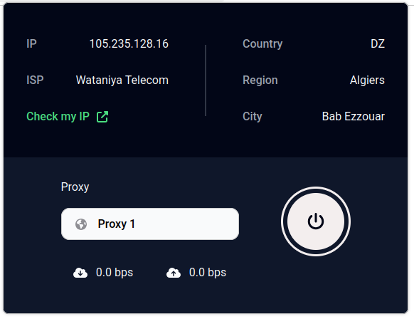

# Firefox Proxy Extension

This guide will help you install, debug, and use the Firefox Proxy Extension. Follow the steps below to get started.

## Installation

1. **Clone the GitHub Repository**

    Open your terminal and run:

    ```sh
    git clone git@github.com:sasori-morningstar/firefox-proxy-extension.git
    ```

2. **Debug in Firefox**

    - Open Firefox and navigate to: `about:debugging#/runtime/this-firefox`
    - Click on **Load Temporary Add-on...**
    - In the file dialog, navigate to the `firefox-proxy-extension` directory and select **manifest.json**.

    

    

3. **Verify the Installation**

    Ensure the Firefox Proxy Extension appears in your list of add-ons.

    

## How to Use

1. **Open the Extension**

    Click on the Firefox Proxy Extension icon in the toolbar.

    

2. **Select a Proxy**

    Choose between **Proxy 1** or **Proxy 2**.

    

3. **Connect/Disconnect**

    - Click the **power button** to start the proxy connection.
    - Click the **power button** again to disconnect.

    
    
    

## How to Configure Proxy Settings

Customize your proxy settings by modifying two constants in the 'scripts/popup.js' file. Look for the constants named proxy1Config and proxy2Config to update the proxy details as needed.

```js
// Proxy 1 configuration
const proxy1Config = {
    type: "http",
    host: "rotating.proxyempire.io",
    port: 9001,
    username: "AcpVQtYstcLT4Q7d",
    password: "wifi;fr;;;"
};

// Proxy 2 configuration
const proxy2Config = {
    type: "http",
    host: "rotating.proxyempire.io",
    port: 9001,
    username: "AcpVQtYstcLT4Q7d",
    password: "wifi;fr;;;"
};
```

After making your changes, save the file and refresh the extension in Firefox to apply the new configurations.

Enjoy seamless proxy management with this extension!
